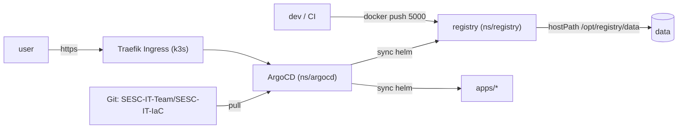

# ArgoCD + Registry: базовое использование

Развёртка инфраструктуры на одном K3s-сервере: приватный Docker-registry, ArgoCD и GitOps-пайплайн на базе этого репозитория.

---

## Что где лежит

| Компонент              | Namespace   | Источник (git)                                      | Комментарий                                     |
|------------------------|-------------|-----------------------------------------------------|-------------------------------------------------|
| K3s                    | -           | [ansible/roles/k3s_setup](../ansible/roles/k3s_setup) | single-node, ставится через ansible             |
| cert-manager           | `cert-manager` | [argocd/bootstrap/cluster-issuer.yaml](../argocd/bootstrap/cluster-issuer.yaml) | выпускает TLS-сертификаты внутреннего CA         |
| Private registry       | `registry`  | [apps/registry](../apps/registry)                   | helm-chart, управляется ArgoCD                  |
| ArgoCD                 | `argocd`    | [argocd/values.yaml](../argocd/values.yaml)         | helm-release `argocd/argo-cd`                   |
| GitOps root app        | `argocd`    | [argocd/bootstrap/root-app.yaml](../argocd/bootstrap/root-app.yaml) | app-of-apps (сканирует `argocd/apps/`) |
| GitOps AppProject      | `argocd`    | [argocd/bootstrap/project.yaml](../argocd/bootstrap/project.yaml)   | права на репозиторий и кластер          |

Порт registry: `5000/tcp` на хосте (`212.113.98.188:5000`).
UI ArgoCD: `https://argocd.sesc-it-team.ru`.



---

## 1. Подготовка сервера (один раз)

Эти шаги **не автоматизированы** — выполняются вручную на сервере `212.113.98.188` перед первым запуском плейбука.

### 1.1 Освободить порты 80/443

K3s по умолчанию поднимает встроенный Traefik, который слушает `80` и `443`. Старый Traefik в docker-compose нужно остановить:

```bash
ssh root@212.113.98.188
cd /opt/apps  # или где лежит клон репозитория с traefik/
cd traefik && docker compose down
```

Проверить, что порты свободны:

```bash
ss -ltnp | grep -E ':80 |:443 '
# вывода быть не должно
```

### 1.2 Установить ansible-зависимости

```bash
cd /path/to/SESC-IT-IaC/ansible
ansible-galaxy install -r requirements.yml
```

Нужна коллекция `kubernetes.core` — она используется для helm-тасков в роли `k3s_setup`.

---

## 2. Запуск bootstrap

```bash
cd /path/to/SESC-IT-IaC/ansible
ansible-playbook -i inventories/local.yml playbooks/k3s-server.yml
```

Что происходит в плейбуке ([ansible/roles/k3s_setup/tasks/main.yml](../ansible/roles/k3s_setup/tasks/main.yml)):

1. Создаются директории `/opt/registry/data` и `/etc/rancher/k3s`.
2. Пишется `/etc/rancher/k3s/registries.yaml` — containerd K3s будет доверять `http://127.0.0.1:5000`.
3. Устанавливается K3s и Helm.
4. Копируется kubeconfig в `/home/root/.kube/config`.
5. Клонируется этот репозиторий в `/opt/apps/SESC-IT-IaC`.
6. Добавляются helm-репозитории и ставится **cert-manager** (jetstack).
7. Применяется цепочка `selfsigned-bootstrap` → `sesc-internal-ca` → `sesc-internal-issuer`, после чего устанавливается ArgoCD с internal TLS.
8. Применяются `argocd/bootstrap/project.yaml` и `argocd/bootstrap/root-app.yaml` (app-of-apps).

После этого ArgoCD сам поднимает registry: root-app сканирует `argocd/apps/`, находит `registry.yaml` и разворачивает helm-чарт из `apps/registry/` в namespace `registry`.

Длительность первого прогона: ~5–10 минут (зависит от скорости сети; helm `wait: true` дожидается подъёма ArgoCD).

---

## 3. Доступ к UI ArgoCD

Открыть в браузере:

```
https://argocd.sesc-it-team.ru
```

Логин: `admin`.

Пароль (начальный) — получить на сервере:

```bash
ssh root@212.113.98.188
kubectl -n argocd get secret argocd-initial-admin-secret \
  -o jsonpath="{.data.password}" | base64 -d
```

**Сменить пароль** после первого входа: *User Info → Update Password*, либо удалить секрет:

```bash
kubectl -n argocd delete secret argocd-initial-admin-secret
```

TLS: сертификат выпускается автоматически через cert-manager и внутренний CA (см. раздел 7). Перед первым открытием UI установите корневой CA на клиентское устройство.

---

## 4. Работа с приватным registry

Registry доступен:

- с сервера: `127.0.0.1:5000` (благодаря `hostPort`);
- из контейнеров/CI в сети: `212.113.98.188:5000`;
- изнутри кластера: `registry.registry.svc.cluster.local:5000`.

### 4.1 На клиенте: разрешить insecure-registry

Registry без TLS, поэтому Docker на клиенте нужно научить доверять ему.

`/etc/docker/daemon.json` (Linux) или `~/.docker/daemon.json` (Docker Desktop):

```json
{
  "insecure-registries": ["212.113.98.188:5000"]
}
```

Перезапустить Docker:

```bash
sudo systemctl restart docker
# или на macOS: перезапустить Docker Desktop
```

### 4.2 Push образа

```bash
docker pull nginx:alpine
docker tag nginx:alpine 212.113.98.188:5000/nginx:alpine
docker push 212.113.98.188:5000/nginx:alpine
```

### 4.3 Проверка содержимого registry

```bash
curl http://212.113.98.188:5000/v2/_catalog
# {"repositories":["nginx"]}

curl http://212.113.98.188:5000/v2/nginx/tags/list
# {"name":"nginx","tags":["alpine"]}
```

### 4.4 Pull из k8s

K3s уже настроен через `/etc/rancher/k3s/registries.yaml` — можно в манифестах писать:

```yaml
image: 127.0.0.1:5000/nginx:alpine
```

---

## 5. GitOps: как добавить новое приложение

Шаблон — это приложение `registry`. Новый сервис добавляется в 3 шага.

### Шаг 1. Helm chart

Скопировать `apps/registry/` → `apps/<myapp>/`, поправить `Chart.yaml`, `values.yaml`, шаблоны в `templates/`.

Структура:

```
apps/<myapp>/
  Chart.yaml
  values.yaml
  templates/
    deployment.yaml
    service.yaml
    ingress.yaml   # если нужен
```

### Шаг 2. Application-манифест

Скопировать [argocd/apps/registry.yaml](../argocd/apps/registry.yaml) → `argocd/apps/<myapp>.yaml`, изменить `metadata.name` и `spec.source.path`:

```yaml
apiVersion: argoproj.io/v1alpha1
kind: Application
metadata:
  name: myapp
  namespace: argocd
spec:
  project: default
  source:
    repoURL: https://github.com/SESC-IT-Team/SESC-IT-IaC.git
    targetRevision: HEAD
    path: apps/myapp
  destination:
    server: https://kubernetes.default.svc
    namespace: myapp
  syncPolicy:
    automated:
      prune: true
      selfHeal: true
    syncOptions:
      - CreateNamespace=true
```

### Шаг 3. Commit + push

```bash
git add apps/myapp argocd/apps/myapp.yaml
git commit -m "feat: add myapp via GitOps"
git push
```

Root Application (`root-app.yaml`) через app-of-apps просканирует `argocd/apps/` и создаст новый `Application` автоматически в течение ~30 секунд. Дальше ArgoCD отрендерит helm-chart и применит его в кластере.

Никакого `kubectl apply` вручную делать **не нужно** — в этом суть GitOps.

---

## 6. Обновление и откат

### Обновить версию приложения

Меняем тег образа в `apps/<myapp>/values.yaml`, коммитим, пушим. ArgoCD применит.

### Обновить сам ArgoCD

В [ansible/group_vars/all.yml](../ansible/group_vars/all.yml) поменять:

```yaml
argocd_chart_version: "7.8.0"   # пример
```

И перезапустить плейбук:

```bash
cd ansible
ansible-playbook -i inventories/local.yml playbooks/k3s-server.yml
```

### Откат Application к предыдущему состоянию

В UI: *Application → History and Rollback*. Либо:

```bash
kubectl -n argocd port-forward svc/argocd-server 8080:443
argocd login localhost:8080
argocd app rollback registry <revision-id>
```

> Внимание: если включён `syncPolicy.automated.selfHeal: true`, ArgoCD вернёт к HEAD из git. Для ручного отката временно отключить `auto-sync` в UI.

---

## 7. TLS и внутренний CA

TLS для ArgoCD и приложений выпускается автоматически через cert-manager и внутренний CA на этапе bootstrap. Конфигурация:

- **cert-manager** (helm-release в namespace `cert-manager`, chart `jetstack/cert-manager`) — ставится плейбуком `k3s-server.yml` до применения issuer-ресурсов. Переменная версии: `cert_manager_chart_version` в [ansible/inventories/group_vars/all.yml](../ansible/inventories/group_vars/all.yml).
- **ClusterIssuer `selfsigned-bootstrap`** — временный issuer для выпуска корневого CA.
- **Certificate `sesc-internal-ca`** — корневой CA в Secret `cert-manager/sesc-internal-ca-secret`.
- **ClusterIssuer `sesc-internal-issuer`** — основной issuer для сертификатов ArgoCD и приложений.
- **Ingress ArgoCD** в [argocd/values.yaml](../argocd/values.yaml) несёт annotations:
  - `cert-manager.io/cluster-issuer: sesc-internal-issuer`
  - `tlsSecretName: argocd-server-tls`

Выпуск сертификата можно проверить:

```bash
kubectl get clusterissuer selfsigned-bootstrap sesc-internal-issuer
kubectl get certificate -A
kubectl get secret -n cert-manager sesc-internal-ca-secret
kubectl describe certificate -n argocd argocd-server-tls
```

Статус `READY=True` у `Certificate` означает, что соответствующий TLS Secret заполнен сертификатом и Traefik отдаёт HTTPS. Сертификат должен содержать hostname приложения в SAN.

### Установка доверия к CA

Получить корневой сертификат можно с кластера:

```bash
kubectl -n cert-manager get secret sesc-internal-ca-secret \
  -o jsonpath='{.data.ca\.crt}' | base64 --decode > sesc-internal-ca.crt
```

Установите `sesc-internal-ca.crt` в доверенные корневые сертификаты клиентских устройств. На macOS это можно сделать через Keychain Access, добавив сертификат в `System` или `login` keychain и выставив для него `Always Trust`. На Linux добавьте файл в системный каталог CA и выполните команду обновления доверия, например `sudo update-ca-certificates` в Debian/Ubuntu. В Windows импортируйте файл в `Trusted Root Certification Authorities`. Для корпоративных устройств предпочтительно распространить CA через MDM/GPO.

### Перевыпуск / смена конфигурации

- Внутренний CA хранится в Secret `cert-manager/sesc-internal-ca-secret`; не удаляйте этот Secret без понимания последствий.
- `letsencrypt-prod` сохраняется в Ansible как opt-in fallback. Чтобы использовать его для конкретного Ingress, замените annotation на `cert-manager.io/cluster-issuer: letsencrypt-prod` и добавьте настройки HTTP-01.
- Для тестирования fallback можно использовать staging-сервер LetsEncrypt: `https://acme-staging-v02.api.letsencrypt.org/directory`.

---

## 8. Troubleshooting

### ArgoCD pods не стартуют

```bash
kubectl -n argocd get pods
kubectl -n argocd describe pod <pod-name>
kubectl -n argocd logs <pod-name>
```

### Application в статусе `Unknown` / `Degraded`

```bash
# На сервере или через argocd CLI
kubectl -n argocd get applications
argocd app get registry
argocd app logs registry
```

Чаще всего причина: ошибка в helm-values или не смонтирован `hostPath` для registry.

### Registry не пушится (http: server gave HTTP response to HTTPS client)

Забыли `insecure-registries` в `daemon.json` — см. раздел 4.1.

### Ingress не отвечает

```bash
kubectl -n argocd get ingress
kubectl -n argocd describe ingress argocd-server
kubectl get pods -n kube-system | grep traefik
```

Проверить, что порты 80/443 свободны на хосте (см. 1.1).

### Полный рестарт всего стека

```bash
ssh root@212.113.98.188
systemctl restart k3s
kubectl -n argocd rollout restart deploy/argocd-server
kubectl -n registry rollout restart deploy/registry
```

---

## 9. Ссылки

- [argoproj/argo-helm](https://github.com/argoproj/argo-helm) — helm chart `argo-cd`
- [K3s registries.yaml docs](https://docs.k3s.io/installation/private-registry)
- [Distribution registry docs](https://distribution.github.io/distribution/)
